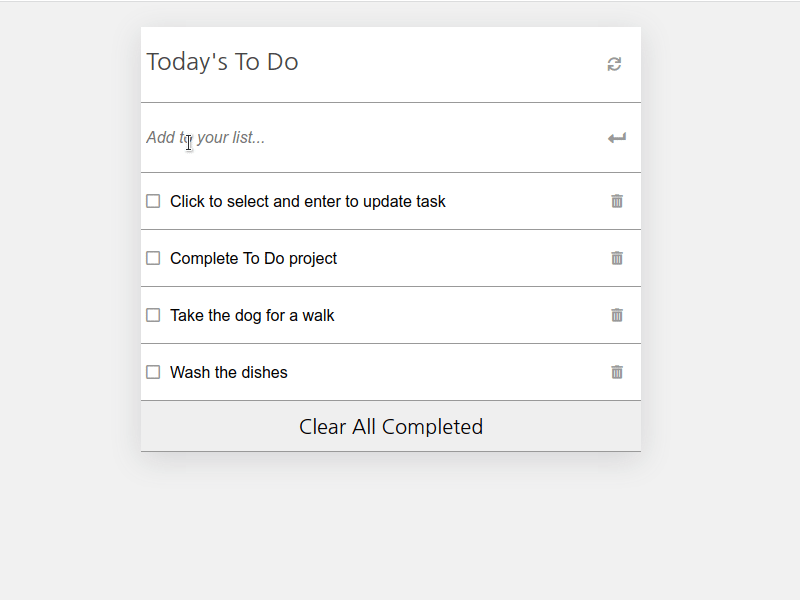

# To Do List


> A simple App to list the things that you need to do. Built using ES6 and Webpack.



## Live Demo

[Live Demo Link](http://todo-webpack.surge.sh/)

## Table of Contents

- [Built With](#built-with)
- [Getting Started](#getting-started)
  - [Prerequisites](#prerequisites)
  - [Setup](#setup)
- [Configuration](#configuration)
  - [Environment Configuration](#environment-configuration)
  - [Additional webpack configuration](#additional-webpack-configuration)
- [Build Assets: Development](#build-assets-development)
  - [One time build assets for development](#one-time-build-assets-for-development)
  - [Build assets and enable source files watcher](#build-assets-and-enable-source-files-watcher)
  - [Start a development server - reloading automatically after each file change.](#start-a-development-server---reloading-automatically-after-each-file-change)
- [Build Assets: Production](#build-assets-production)
- [Run Code Style Linters](#run-code-style-linters)
  - [SASS](#sass)
  - [JavaScript](#javascript)
- [Additional Tools](#additional-tools)
  - [Run Assets Bundle Analyzer](#run-assets-bundle-analyzer)
- [Author](#author)
- [Show Your Support](#how-your-support)
- [Acknowledgments](#acknowledgments)
- [License](#license)

## Built With

- [Webpack 5](https://github.com/webpack/webpack) - _JavaScript_ module bundler.
- [SASS](https://github.com/sass/sass) compiler based on Dart `sass`.
- [Babel 7](https://github.com/babel/babel) (`@babel/core`) - JavaScript compiler - _Use next generation JavaScript, today._

## Getting Started

To get a local copy up and running follow these simple example steps.

### Prerequisites

- `node` : `^12 || >=14`
- `npm`

### Setup

1. Download or fork this project
2. Extract the release archive to a new directory, rename it to your project name and browse the directory.
3. Install all dependencies using `npm` _clean install_ command.

```sh
npm ci
```

More on the clean install npm command can be read here [`npm ci`](https://docs.npmjs.com/cli/ci.html)
You can still use `npm install` in cases the `npm ci` raises system error due to specific platform incompatibilities.

## Configuration

### Environment Configuration

- Edit the [`configuration/environment.js`](configuration/environment.js) if you want to specify:
  - **`server`**: configure development server, specify `host`, `port`. Refer to the full development server configuration options for [`webpack-dev-server`](https://webpack.js.org/configuration/dev-server/).
  - **`limits`**: configure file size thresholds for assets optimizations.
    - Image/Font files size in bytes. Below this value the image file will be served as Data URL (_inline base64_).
  - **`paths`**: `src` or `dist` directories names and file system location.

### Additional `webpack` configuration

You can additionally configure `webpack` for specific environment:

- `development` - [`configuration/webpack.dev.config.js`](configuration/webpack.dev.config.js)
- `production` - [`configuration/webpack.prod.config.js`](configuration/webpack.prod.config.js)
  - Note that if you prefer to build and deploy [`sourcemap`](https://webpack.js.org/configuration/devtool/#production) files:
    > You should configure your server to disallow access to the Source Map file for normal users!

## Build Assets: Development

### One time build assets for development

```sh
npm run build
```

### Build assets and enable source files watcher

```sh
npm run watch
```

### Start a development server - reloading automatically after each file change

```sh
npm run dev
```

## Build Assets: Production

Optimize assets for production by:

```sh
npm run production
```

## Run Code Style Linters

### SASS

```sh
npm run lint:sass
```

### JavaScript

```sh
npm run lint:js
```

## Additional Tools

### Run Assets Bundle Analyzer

```sh
npm run stats
```

> This will open the visualization on the default configuration URL `localhost:8888`, you can change this URL or port following the [package](https://github.com/webpack-contrib/webpack-bundle-analyzer#options-for-cli) documentation.

## Author

👤 **Fabricio Garcia**

- GitHub: [@fabgrel10](https://github.com/fabgrel10)
- LinkedIn: [fabgrel10](https://www.linkedin.com/in/fabgrel10/)
- Twitter: [@fabgrel10](https://twitter.com/fabgrel10)

## Show your support

Give a ⭐️ if you like this project!

## License

This project is [MIT](./MIT.md) licensed.
